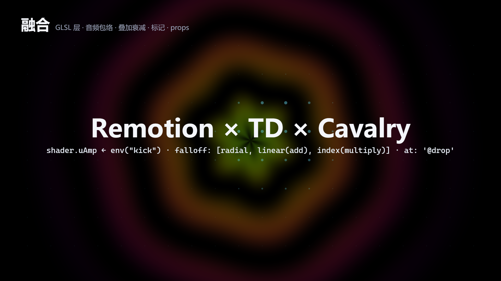
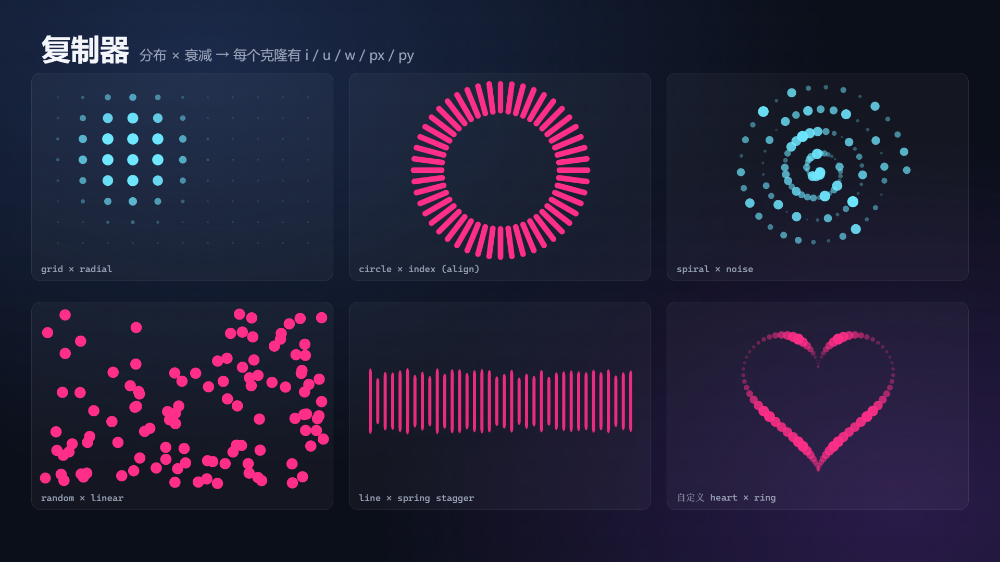
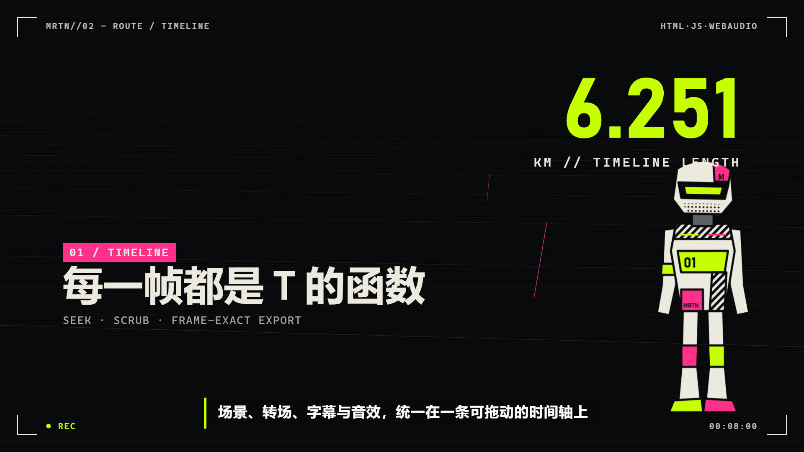

# HTML Motion Kit

纯 HTML/JS 的动态图形与视频框架。画面是时间 `t` 的纯函数，可以在浏览器里拖动预览，再由无头 Chrome 逐帧导出 MP4，预览与导出结果一致。

它把 TouchDesigner 的通道（CHOP）和 GLSL、Cavalry 的复制器 / 衰减 / 行为做成一套 JSON 节点图，同时吸收了 Remotion、Motion Canvas、Rendervid 等框架的做法。每个效果都可以复用，每段运动都能追溯来源，适合人手写，也适合交给 AI 生成和修改。

| 融合场景（着色器 × 音频包络 × 叠加衰减） | 复制器 × 分布 × 衰减 | 示例 Marathon |
|---|---|---|
|  |  |  |

## 特点

- **帧精确时间轴**：tween、转场、字幕、程序化音效都挂在同一条时间轴上，可以拖动、跳章节、逐帧导出。
- **数据节点图**：`channel / layer / object / duplicator` 四类节点，参数支持关键帧、链接、行为（fx）、表达式，整个场景可以写成 JSON。
- **可追溯**：每个动画属性都记录来源（`node:dots`、`preset:wobble > op:tween`），`tl.inspect()` 导出完整轨迹，预览页带检查器（按 `I`）。
- **GPU 着色器层、音频包络、叠加衰减、命名标记、input props、并行导出**：详见下文「融合」一节。
- **角色与三维**：单张 PNG / SVG 的网格变形角色（Live2D 式），Canvas2D 伪 3D（点、线、面、雾效）。
- **程序化音效**：whoosh、pop、click、鼓机等全部由 WebAudio 合成，无需素材，离线渲染后与画面合流。
- **DSH 插件**：可作为 DeepSeek Harness 插件加载，Agent 直接调用 `motion_new / motion_still / motion_render`，见「作为 DSH 插件」。
- **无构建步骤**：原生 ES 模块，唯一的 npm 依赖是 `puppeteer-core`。

## 快速开始

```bash
npm install
npm run new -- my-video --title "我的项目"        # 生成 projects/my-video（连续模式）
npm run new -- my-deck --title "我的项目" --mode scenes   # 翻页模式
npm run new -- my-howto --title "我的项目" --mode tutorial  # 教程：光标主线 + 交接
npm run img -- --manifest projects/my-video/assets.json   # 生成图片素材
npm run serve                                      # http://127.0.0.1:5173/projects/my-video/
npm run render -- projects/my-video                # → projects/my-video/out.mp4
npm run render -- projects/my-video --still 3.5 --out f.png   # 单帧检查
```

依赖：Node 18+、Chrome 或 Edge（或 `CHROME_PATH`）、PATH 中的 `ffmpeg`。
图片接口：`OPENAI_API_KEY`、`OPENAI_BASE_URL`（中转网关，默认官方）、`IMAGE_MODEL`（默认 `gpt-image-2.5-sunburst`）。密钥只从环境变量读取。

## Agent 工作流

1. 读取目标项目（README、功能、命令、界面），写出分镜：每个场景的目的、时长、画面、字幕。
2. 写 `assets.json`：背景、角色（`transparent: true`，全身正面、手臂自然下垂、脚贴底边）、表情变体（`edit` 基于角色图）。
3. `npm run img -- --manifest …`：已存在的文件会跳过（`--force` 重新生成），每张图旁写入 `.prompt.json`。
4. 在 `index.html` 中编写场景；`npm run audit -- projects/<name>` 扫全片拿数字结论（裁切、出画、压叠、空帧、偏空 `--sparse 0.8`、静止 `--still 1.5`、镜头超速 `--max-px 80`），再抽 1~2 帧确认审美，最后完整导出。
   写完前 2~3 段就先审一次（`--to <秒>`），别等全片写完再返工。输出分两级：**问题**是阻塞项（退出码 1，导出前必须为 0）；**提示**不阻塞（交接无延续、dense 段文字太少、颜色 >6 种、字号 >7 种），默认打印，`--no-hints` 关闭。

开工前建议先扫一遍 [`docs/lessons.md`](docs/lessons.md)：那是踩过的失败清单（会静默失效的 API 语义、让画面变难看的视觉禁忌、绝对定位与全局 CSS 的坑）。

## 连续模式（默认模板）

章节横排在一条长画布上，镜头一路平移；背景和进度轴全程不停。没有转场，也就没有"翻页感"。

```js
await createVideo({
  width: 1920, height: 1080, fps: 30,
  look: 'light', theme: { accent: '#1a73e8' },   // 浅色 + 单一主色
  background: 'network',                         // 或 'grid' / { type: 'network', count: 30 } / null
  progress: true,                                // 底部进度轴，刻度来自章节 title
  camera: { ease: 'inOutQuad', maxPx: 80 },      // 可选；移动时长按峰值速度自动算
  chapters: [{
    id: 'intro', title: '开场', dur: 5,
    html: `<div class="wrap mid">…</div>`,
    build(tl, el, ctx) { /* 局部 0 = 镜头开始驶向本章；ctx.arrive = 到位时间 */ },
  }],
});
```

- 引擎自动给每章 `left: k × width`、生成镜头关键帧（峰值 ≤ `maxPx`/帧，到位后保持 ~10px/s 漂移）。
- 章节 `dur` 必须 ≥ 镜头移动时长 + 0.5s，否则直接报错。
- 内容请在 `ctx.arrive` **之前**开始入场（例如 `at: 0.3`），镜头到位时画面已经有字。
- `registerBackground(name, (tl, host, opts) => canvas)` 可扩展背景层。

## 交接、光标与节奏（两种模式通用）

每个交界至少让一样东西延续到下一段，否则就是翻页（`docs/lessons.md` §3.4）。

```js
// 相邻两段里放同名 data-carry：交界处原件隐藏，快照在屏幕空间从 A 的位置飞到 B 的位置
html: `<span class="goal" data-carry="goal">目标：做出第一个结果</span> …`,

build(tl, el, ctx) {
  // 全片只有一个光标：任何一段调用都接在同一条路径上，跨交界时直接飞过去
  ctx.cursor([
    { to: el.querySelector('.input'), at: 0.6, dur: 0.8, click: true, press: true },
    { to: [960, 540], at: 2.4 },       // 本段坐标
    { hide: 5.2 },                     // 淡出；之后的下一次移动会淡入
  ]);
},
rhythm: 'dense',                       // 'anchor' | 'dense' | 'breathing'
```

- carry 飞行时长 = max(转场/镜头时长, 按 `maxPx`/帧 限速)；内容不同时几何插值，中间 30% 交叉淡化，不透明度之和始终 ≥ 1。同一段里名字不能重复（直接报错）。
- rhythm：`breathing` 合计 ≤ 全片 30%，且不能连着两段，违反是阻塞问题；breathing 段放宽「偏空」「静止」；`dense` 段平均文字块 <4 会给提示。
- 构建后 `__video.timeline.carry` 里有 `flights` 和每个交界的 `boundaries`（审计据此出「交接」提示）。
- `--mode tutorial` 模板是完整示例：目标标签跨章节飞行，光标点输入框 → 敲命令 → 结果出现。

## 场景（翻页模式）

`background` / `progress` / `look` 在场景模式下同样可用；有背景时场景自带 10px/s 漂移（`drift: 0` 关闭），`.scene` 不要加不透明底色。

```js
await createVideo({
  width: 1920, height: 1080, fps: 30,
  theme: { accent: '#6ee7ff', accent2: '#a78bfa' },  // 写入 CSS 变量 --accent 等
  music: { src: 'assets/music.mp3', volume: 0.3 },   // 可选
  ready: [puppet.ready],                             // 首帧前等待
  scenes: [{
    id: 'intro', title: '开场', dur: 6, className: 'bg-grad',
    transition: 'zoom',            // 或 { type: 'slide', dur: 1, sfx: 'whoosh' }
    html: `<div class="center"><h1 class="title">…</h1></div>`,
    build(tl, el, ctx) { /* 时间为场景内时间，从 0 开始 */ },
  }],
});
```

转场：`cut fade zoom slide up wipe circle flip glitch`，和上一场景重叠 `dur` 秒（默认 0.8），并自动配音效；未知类型直接报错。
避免空帧：本场景内容在最后 `dur` 秒淡出，下一场景内容在转场一开始就入场（模板里的 `leave()` 就是这么写的）。
CSS 组件（`engine/base.css`）：`.center .title .subtitle .grad-text .bg-image .bg-grad .card .bullets .code .window>.bar .step-num`。

## Timeline

所有画面都是时间 t 的纯函数，所以可以拖动、跳转章节、逐帧导出。

- `tl.to / from / fromTo(el, props, { at, dur, ease })`，`tl.set(el, props, { at })`
- 属性：`x y scale scaleX scaleY rotate rotateX rotateY opacity blur brightness clip`，以及任意 `--css-var`
- `at`：`2.5` 场景内绝对时间 · `'+0.3'` 上一项结束后 · `'-0.2'` 与上一项重叠 · `'<'` 与上一项同时开始 · `'<0.1'`
- `tl.add((lt, t) => …)` 每帧回调 · `tl.modify(el, lt => deltas, { at, dur })`
- `tl.sfx(name, at, { volume, dur })` · `tl.audio(src, at, opts)` · `tl.caption(text, at, dur)`
- 缓动：`linear`，`in/out/inOut` + `Quad Sine Cubic`，`outQuart inOutQuart outExpo inOutExpo inBack outBack`，`outBounce` `outElastic` `spring`，或自定义函数；未知名字直接报错

## fx

| 函数 | 用途 |
|---|---|
| `textIn(tl, el, { preset, by: char/word, stagger, ease, sfx })` | 文字入场。`line`（整行上浮，大标题首选）`fade` `blur` 整行动；`rise drop pop flip wave` 逐字 |
| `typewriter(tl, el, { cps })` | 打字效果，读取 `data-text` |
| `counter(tl, el, { from, to, dur, decimals, format })` | 数字滚动 |
| `staggerIn(tl, els, { from, stagger, sfx })` | 列表依次入场 |
| `cursor(tl, stage, [{ to: [x,y] \| el, at, dur, click, press }])` | 教程光标与点击 |
| `highlight(tl, stage, el, { at, dur })` | 聚焦框 |
| `kenBurns` `parallax` `float` `shake` `drawPath` | 镜头与运动 |
| `particles(tl, el, { mode: dust/bokeh/burst/confetti/stars, count, colors, origin })` | 粒子（浅色底上慎用 bokeh） |

音效（程序合成，无需素材）：`whoosh swoosh pop click tick type ding success error rise impact sparkle glitch blip`。可用 `registerSfx(name, (ctx, out, t, opts) => …)` 扩展。

## 角色（Live2D 式）

```js
const p = new MeshPuppet({ src: 'assets/mascot.png', width: 520, height: 780, headLine: 0.5 });
// headLine：脖子所在的高度比例（0 为顶，1 为底）
el.appendChild(p.el);
tl.add((lt) => p.update(lt));
p.emote('bounce', 1.3).emote('nod', 3, 0.9).emote('tilt', 5).emote('shake', 6);
p.talk(2, 4);   // 需要张嘴素材（LayeredPuppet）
```

`MeshPuppet` 对单张透明 PNG 做三角网格变形，实现呼吸、摆动、头部转动和头发滞后。`LayeredPuppet({ width, height, parts: [{ src, x, y, w, h, pivot, z, … }] })` 用分层部件做眨眼、说话和视差，部件的 `role` 可取 head/eyes/eyesClosed/mouth/mouthOpen 等，用 `gen-image --edit` 从基础角色图派生。

## 三维（Space3D）

Canvas2D 伪 3D，点 / 线 / 面，雾效与叠加混合，无 WebGL 依赖，逐帧确定。

```js
const sp = new Space3D(el, { fov: 900, fog: [600, 6000] });
const route = sp.add(Space3D.polyline(pts, { color: '#c6ff00', width: 3, progress: 0 }));
sp.add(Space3D.grid(8000, 250, { y: 400, opacity: 0.3 }));
tl.to(route, { progress: 1 }, { at: 0.5, dur: 3 });   // 对象可补间
tl.to(sp.cam, { z: 600, ry: 20 }, { at: 0, dur: 6 }); // 相机可补间
sp.bind(tl);
```

几何：`points polyline plane quad grid lattice sphere ring cloud box`，`Space3D.along(pts, f)` 取路径上的点。

## 进阶

- fx：`scramble`（乱码解码文字）、`glitch`（RGB 分离抖动）、`sequence`（可寻址的图片序列层）
- 转场：`slash`、`shutter`（百叶窗，`n` 条数）；`registerTransition(name, fn, sfx)` 自定义
- 音效：柔和系 `air`（转场气流）`thump`（温和低音重音）`soft`（UI 轻点，`freq`）`chime`（双音收尾），偏硬的 `scan bass hud`；程序化鼓机 `beat`：`tl.sfx('beat', 0, { dur, bpm, pattern: 'x...x...', root, fadeIn, fade, warm: true })`
- 示例：`projects/marathon`（Marathon 风格，3D 路线 / 点阵 / 线框隧道，约 36 秒）。角色 `assets/runner.svg` 为手绘平面矢量，MeshPuppet 同样支持 SVG

## 节点图（数据化编辑）

参考 TouchDesigner 的通道（CHOP）和 Cavalry 的复制器 / 衰减 / 行为。整个场景都可以用 JSON 描述：`tl.graph(env).add(items)`，也可以 `Graph.fromJSON(tl, json, env)`。示例见 `projects/graph-demo`。

```js
const g = tl.graph({ root: el, stage: el, refs: { ring, runner } });
g.add([
  { kind: 'node', id: 'beat', type: 'channel', params: { v: { value: 0, fx: [{ type: 'pulse', bpm: 120 }] } } },
  { kind: 'node', id: 'dots', type: 'duplicator', parent: '@stage', html: '<i class="dot"></i>', count: 48,
    distribution: { type: 'grid', cols: 12, spacing: [60, 60] },
    falloff: { type: 'radial', center: { expr: '[960 + sin(t) * 400, 540]' }, radius: 360 },
    params: { scale: { value: 1, fx: [{ type: 'falloff', rest: 0.2 }], expr: 'value * (1 + ch("beat.v") * 0.3)' } } },
  { kind: 'node', id: 'ring', type: 'object', target: '@ring', params: { ry: { expr: 't * 30' } } },
  { kind: 'op', op: 'counter', target: '.hud', params: { to: 42195 } },
  { kind: 'preset', preset: 'wobble', target: '.hud', params: { amp: 2 } },
]);
```

节点类型：
- `channel`：纯数据通道，供其他节点通过 `link` 或 `ch("id.param")` 引用。
- `layer`：DOM 元素，`target` 可以是选择器或元素。
- `object`：任意对象，比如 Space3D 物体、`@runner.params`（角色参数）或纯 JS 对象。
- `duplicator`：批量复制节点。DOM 版本用 `html` 和 `parent`，Space3D 版本用 `space` 和 `shape: { type, args }`。它会自动把 `px/py` 加到 `x/y` 上。

`mode`：
- `'set'`（默认）：覆盖原有值，`value` 默认取当前值。
- `'add'`：叠加在现有 tween 之上。

参数规格（param spec）可以是常量，也可以是对象：
```text
{ value, keys: [[t, v, ease], ...], loop, delay, stagger,
  link: 'node.param', lag, mul, add, fx: [...], expr, min, max }
```
求值顺序：value / keys / link → fx → expr → min / max。

- fx 行为：`noise oscillate spring pulse step random falloff quantize math`。
- expr 可用的变量：`t lt i n u w px py value`，函数有 `ch() lerp clamp noise hash TAU`，以及全部 Math 函数。
- 分布：`grid line circle spiral random points`。
- 衰减：`none radial linear index noise`。衰减的参数本身也可以是动画 spec，权重写入 `w`。
- 算子（op，可复用特效）：`tween set textIn typewriter counter staggerIn kenBurns float shake drawPath scramble glitch highlight particles emote talk sfx caption`。也可以直接调用 `tl.op('shake', el, { amp: 8 })`。
- 预设（preset，由多个 item 组成的模板，支持 `{{param}}` 占位）：`wobble beatPulse popIn`。
- 扩展方式：`defineOp`、`definePreset`、`registerBehaviour`、`registerDistribution`、`registerFalloff`，均从 `engine/index.js` 导出。
- 实时修改：`g.set('beat.v', 0.5)`；读取：`g.get('dots.scale', t)`。

在引用名前加 `@` 表示引用 `refs`，并支持点路径，例如 `@runner.params`。常见错误会明确抛出：未知 ref、未知算子、重复 id、link 循环。

注意：`expr` 通过 `new Function` 执行，属于项目内受信代码。不要把来自外部或用户输入的字符串当作表达式。

### 可追溯

- 每个 tween、modifier 和 renderer 都记录了来源 `src`，例如 `node:dots`、`op:counter`、`preset:wobble > op:tween`。
- 用 `tl.trace(label, fn)` 手动打标签，用 `tl.name(target, '名字')` 命名目标。
- 纯查询接口，不修改目标：
  - `tl.evaluate(target, t)`
  - `tl.valueAt(target, prop, t)`
  - `tl.sample(target, prop, t0, t1, n)`，返回 `[[t, v], ...]`
- `tl.inspect()` 返回可序列化为 JSON 的完整轨迹：targets、ops、graphs、cues、captions。预览页的 `player.inspect()` 也会返回同样的内容。
- `tl.modify(target, fn, { mode: 'set' })` 让返回值直接覆盖，回调签名为 `(lt, gt, cur)`。

### 检查器

预览时按 `I` 切换，也可以在 URL 上加 `?inspect` 直接打开。导出时不会出现。
- 轨道：所有动画属性、来源，以及曲线（带当前时间线）。
- 节点图：节点参数，数值可以直接编辑并即时生效。
- 算子：调用记录。
- 「导出 JSON」：复制完整轨迹。

测试（不依赖 DOM）：`npm test`（即 `node --test tests/*.test.mjs`）

## 融合（借鉴自其他框架）

保留节点图、可追溯这些特点，同时吸收市面项目的做法。所有新能力都是时间的纯函数，可以拖动，导出结果与预览一致。

| 来源 | 能力 | 用法 |
|---|---|---|
| TouchDesigner GLSL TOP / cables.gl | GPU 着色器层 | `new ShaderLayer(el, { frag, uniforms }).bind(tl)`；uniform 是普通数字或数组，可以补间，也可以作为节点 `target: '@sh.uniforms'` |
| TouchDesigner Audio CHOP | 音频包络通道 | `await analyzeAudio(src, { name, bands: { low: [20, 200] } })` 或 `registerEnvelope(name, data, fps)`；fx `{ type: 'envelope', name }`，expr 中用 `env("name")` |
| Cavalry / C4D 效果器场 | 叠加衰减 | `falloff: [a, { ...b, blend: 'add' }, { ...c, blend: 'multiply', invert: true, strength: 0.5 }]`；blend 可取 `multiply add subtract max min screen`；`clamp: false` 允许权重超出 0..1（放大或反向推开） |
| Motion Canvas 时间事件 | 命名标记 | 场景 `markers: { drop: 2.4 }` 或 `tl.marker('drop', 2.4)`，然后用 `at: '@drop'`、`'@drop+0.2'` |
| Remotion input props | 同一页面换数据 | `createVideo({ props })` 作为默认值，可被 `?props=<json>` 或 `render --props file.json` 覆盖；html 和 graph 中用 `{{name}}`，代码中用 `ctx.props` |
| Rendervid / Creatomate JSON | 场景即数据 | 场景 `graph: [items]`，不写 `build` 也可以 |
| Remotion 分块渲染 | 并行导出 | `render --workers 4`，分段后无损拼接 |

未知的包络、衰减 blend 或标记都会直接抛错。示例见 `projects/graph-showcase` 第 6 幕。

## TouchDesigner

TouchDesigner 适合做生成式背景、粒子和 GLSL 效果，但它不能被浏览器逐帧驱动，所以采用“预渲染序列”：

1. 在 TD 中用 `Movie File Out TOP`，Type 设为 Image Sequence（PNG），输出到 `projects/<name>/assets/td/`，文件名如 `td.0001.png`。
2. 场景中引入：`fx.sequence(tl, el, { src: 'assets/td/td.####.png', start: 1, count: 180, fps: 30, blend: 'screen' })`，并把返回的 `ready` 放入 `createVideo({ ready })`。
3. 画面随时间轴精确寻址，导出结果与预览一致。

注意：非商业版 TD 输出分辨率上限为 1280×1280（`fit: 'cover'` 会放大），`Movie File Out` 需要打开 TD 运行（无头模式需 TouchEngine / 商业授权）。实时互动（WebSocket DAT ↔ 浏览器）可用于预览，但不可用于逐帧导出。

## 作为 DSH 插件（DeepSeek Harness）

本仓库同时是一个 DeepSeek Harness（DSH） 插件包。装进 DSH 后，Agent 获得一个 `html-motion-kit` skill 和五个工具，可以在对话里直接写视频、审计画面、抽帧检查、导出 MP4。

```bash
git clone https://github.com/Slapq/html-motion-kit && cd html-motion-kit && npm install
dsh plugin --profile web add link:$(pwd)     # 或换成你的 profile 名
dsh web
```

| 工具 | 作用 |
|---|---|
| `motion_info` | 根目录、README 路径、已有项目列表 |
| `motion_new` | 创建 `projects/<name>`（`mode`: `continuous` 默认 / `scenes`，浅色模板，开箱审计 0 问题） |
| `motion_audit` | 扫完整条时间轴，报阻塞问题（裁切 / 出画 / 压叠 / 空帧 / 偏空 / 静止 / 节奏违规 / 镜头超速）和不阻塞的提示（交接、字号、颜色） |
| `motion_still` | 渲染时间 `t` 的单帧 PNG，可传 `props` |
| `motion_render` | 导出 MP4，支持 `from / to / fps / workers / props` |

- 工具直接调用 `tools/new-project.mjs`、`tools/audit.mjs` 和 `tools/render.mjs`，与命令行结果一致。
- 项目名只允许字母、数字、`-`、`_`；输出文件必须在项目目录内，越界路径直接报错。
- 配置（`dsh/cordis.patch.yml`）：`root`（默认本仓库）、`timeoutSec`（默认 1800）。
- 依赖与命令行相同：Chrome / Edge、PATH 中的 `ffmpeg`。
- Agent 写视频前会读到 `docs/lessons.md`（实战经验与坑），里面记录了容易静默失败的 API 语义和视觉禁忌。

## 导出参数

`--out --fps --from --to --scale --crf --mute --chrome --still --props --workers`。页面带 `?export` 时会隐藏控制条，音频离线渲染后与画面合流。

## 许可

MIT，见 [LICENSE](LICENSE)。
