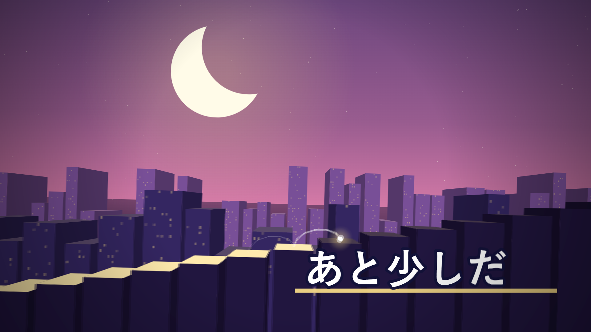

<div align="center">

# Kinema

### 面向 Agent 的视频创作器

告诉 Agent 你想要一支什么样的片子，它写场景、抽帧检查、量节奏、改到满意，最后交给你一支帧精确的 MP4。

<p>
  
  
  
  
  
</p>

[参考手册](docs/reference.md) · [引擎经验](docs/lessons.md) · [作品](#-作品)

</div>

<p align="center">
  
</p>
<p align="center"><sub>三日月ステップ PV 的一帧。全部是几何：新月是「君」，光点是「僕」，楼顶是他走过的台阶。</sub></p>

## 为什么是 Kinema

大多数视频工具是给人用鼠标操作的。Kinema 是给 Agent 写的：整支片子就是一页 HTML，画面是时间 `t` 的纯函数。

| 你得到什么 | 实际含义 |
|---|---|
| **Agent 能看见自己的作品** | 任意一帧都能抽出来看，整条时间轴能扫出裁切和出画，每章的节奏能量出来。写、看、改是一个闭环，不靠猜 |
| **预览就是成片** | 浏览器里拖动预览，无头 Chrome 逐帧导出，两边逐帧一致。不掉帧，不漂移 |
| **不只是幻灯片** | 连续镜头、跨段交接、GPU 着色器、伪 3D、可变形角色、节点图、跟着音乐走的画面，都在同一条时间轴上 |
| **出错会直接说** | 写错缓动名、转场、引用都会立刻报错，而不是悄悄变成另一种效果 |
| **零构建** | 原生 ES 模块，只有一个 npm 依赖。打开就能写 |

## ✨ 能做什么

| | 能力 | 说明 |
|---|---|---|
| 🎬 | **镜头语言** | 一镜到底的连续平移、翻页转场、甩镜与真实运动模糊、手持感与击打震动 |
| 🧵 | **交接与光标** | 元素跨段飞行衔接，全片唯一的光标主线，适合教程和产品演示 |
| 🎵 | **声音** | 配乐、素材音效、二十多种程序合成音效；分析音频包络，让画面跟拍 |
| 🧊 | **三维与着色器** | Canvas 伪 3D（点线面、雾效）、字符化 3D、GLSL 着色器层 |
| 🧍 | **角色** | 单张 PNG / SVG 的网格变形角色：呼吸、点头、转头、头发滞后 |
| 🕸️ | **节点图** | 复制器、衰减、行为、表达式，整个场景可以写成 JSON 交给 Agent 改 |
| 🔍 | **可追溯** | 每段运动都记得自己从哪来，预览时按 `I` 打开检查器 |
| 🖼️ | **素材生成** | 写一份素材清单，背景、角色和表情变体一次生成 |

## 🚀 快速开始

```bash
npm install
npm run new -- my-video --title "我的第一支片子"
npm run serve          # 打开 http://127.0.0.1:5173/projects/my-video/
npm run render -- projects/my-video
```

需要 Node.js 20+、Chrome 或 Edge、PATH 中的 `ffmpeg`。

然后把 Agent 指向这个仓库，告诉它你要什么：

```text
用 Kinema 给这个仓库做一支 40 秒的介绍片，给第一次看到它的开发者看，
重点让人记住它能一行命令装好。浅色，节奏利落。
```

模板有三种：`continuous`（一镜到底，默认）、`scenes`（翻页）、`tutorial`（光标演示），用 `--mode` 选。

## 🧭 一支片子怎么做出来

Kinema 不替你定审美，它给 Agent 一套做片的方法和一组只报事实的仪器。

1. **先定原则**：给谁看，要让人记住什么。有参考就逐帧拆参考。
2. **写分镜，写场景**：每段的目的、时长、画面、字幕。
3. **抽帧看**：`npm run render -- <项目> --still 12.5 --out f.png`
4. **用仪器找问题**：`npm run audit` 找裁切和出画，`npm run pacing` 看每章演完后空等了多久。
5. **看成片**：导出、和参考并排看。好不好看靠看，不靠指标。

## 🎞️ 作品

| | |
|---|---|
|  | **三日月ステップ PV** · `projects/mikazuki-pv`<br>一首 3 分钟的歌，没有人物，只有几何。一句歌词一个镜头，句内缓推蓄势，换句时甩到下一个构图。「カゴの中」竖线落下切开新月，「売られてた」竖线变成条码，新月被框进画框。 |
|  | **Marathon** · `projects/marathon`<br>3D 路线、点阵和线框隧道，手绘矢量角色在其中奔跑。 |
|  | **节点图展示** · `projects/graph-showcase`<br>着色器、音频包络与叠加衰减组合在一个场景里。 |

> [!NOTE]
> 三日月ステップ 的歌曲版权属于 r-906，PV 仅作个人同人用途，音频不随仓库分发。

## 📚 文档

| 文档 | 内容 |
|---|---|
| [参考手册](docs/reference.md) | 完整 API：场景结构、Timeline、fx、声音、3D、节点图、检查器、命令行参数、Agent 工具接口 |
| [引擎经验](docs/lessons.md) | 会悄悄失效的 API、版面坑、环境坑。Agent 开工前读它 |

## 🔌 接入 Agent

任何能跑命令行的 Agent 都能直接用 Kinema。仓库也自带一组工具接口（新建、抽帧、审计、节奏、导出），可以挂到 DeepSeek Harness 这类 Agent 宿主上，详见 [参考手册](docs/reference.md#agent-工具接口)。

## ⚠️ 边界

> [!WARNING]
> - 节点图里的表达式会作为代码执行，只放你自己写的内容，不要放外部输入。
> - 生图接口的密钥只从环境变量读取（`OPENAI_API_KEY` 等），不要写进项目文件。
> - 审计只量 DOM 文字；全部画在 canvas 上的片子，空帧和偏空读数没有意义。

## 许可证

MIT，见 [LICENSE](LICENSE)。
